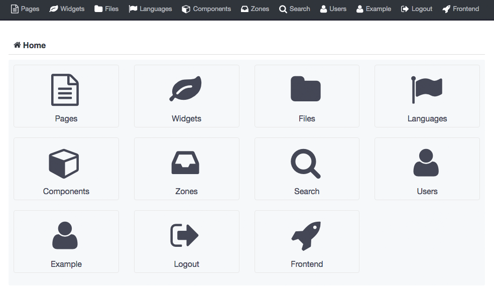

axipi
======

```
composer install
bin/console doctrine:fixtures:load --append --fixtures="src/Axipi/CoreBundle/DataFixtures"
bower install
```

http://example.com/backend
- Email: example@example.com
- Password: example


